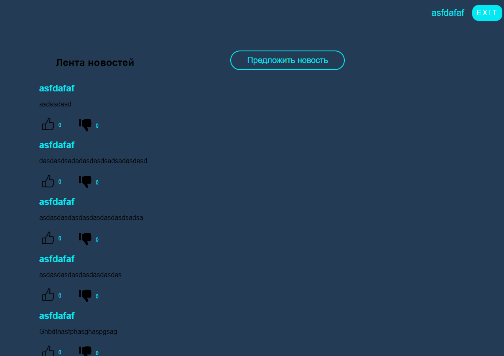

# Лабораторная работа №2
------

## Основное задание
Разработать и реализовать клиент-серверную информационную систему, реализующую мехнизм CRUD. Система представляет собой веб-страницу с лентой заметок и форму добавления новой заметки. Система должна обладать следующим функционалом:
- Добавление текстовых заметок в общую ленту
- Реагирование на чужие заметки (лайки)

## Дополнительные задания

В качестве дополнительного функционала можно реализовать следующие задачи:

- Добавление изображений
- Дизлайки

## Ход работы

### 1. Разработка пользовательского интерфейса

- Главная страница




### 2. Описание пользовательских сценариев работы
На сайте пользователю доступны следующие возможности:
- Опубликовать новую запись
- Поставить реакцию на опубликованные ранее записи
- Чтение старых записей

После нажатия на кнопку "Отправить", страница форума обновится и среди всех записей появится новая запись от пользователя.

Количество реакций от одного пользователя ограничено 1 реакцией.


### 3. Описание структуры базы данных

Для хранения данных форума используется база данных MySQL. Всего в базе данных содержится 4 таблицы: таблица с информацией о записях на форуме, таблица с информацией о лайках и таблица с информацией о дизлайках и таблица с зарегистрированными пользователями.

Таблица о записях содержит в себе индивидуальный номер записи, текст записи, количество лайков количество дизлайков и изображение.


```sh
id - уникальный идентификатор заметки (int);
user - имя пользователя(автора), кто написал заметку (varchar(100));
text - текст заметки (text);
likes - колличество лайков для данного поста (int(100));
image - изображение для данного поста (longblob);
```

Таблица с лайками/дизлайками содержит номер поста и номер пользователя


```sh
id_post - идентификатор поста к которому был поставлен лайк (varchar(255));
id_user - идентификатор пользователя который поставил лайк (varchar(255));
```


## Значимые фрагменты кода
Фрагмент кода, обработки лайков:
```sh
if($mysql_date -> num_rows > 0) {
    $like_count = $like_count - 1;

    $mysql2->query("DELETE FROM posts_like WHERE id_post = $post_id AND id_user = $user_id");
    $mysql1->query("UPDATE posts SET likes = $like_count WHERE id = $post_id");
    header('Location: /lab_2_egor/main.php');

} else {

    $mysqlLike = new mysqli('localhost', 'root', 'root', 'login_form');
    $mysql_post_like = $mysqlLike->query("SELECT COUNT(*) as count FROM posts_dislike where id_post = $post_id ");
    $mysql_post_like = $mysql_post_like->fetch_assoc();
    $like_count_like = $mysql_post_like["count"];

    $mysql2_like = new mysqli('localhost', 'root', 'root', 'login_form');
    $mysql_date_like = $mysql2_like->query("SELECT * FROM posts_dislike WHERE id_post=$post_id AND id_user=$user_id");

    if($mysql_date_like -> num_rows > 0) {
        $like_count_like = $like_count_like - 1;

        $mysql2_like->query("DELETE FROM posts_dislike WHERE id_post = $post_id AND id_user = $user_id");
        $mysqlLike->query("UPDATE posts SET dislikes = $like_count_like WHERE id = $post_id");

        $like_count = $like_count + 1;

        $mysql2->query("INSERT INTO posts_like (id_post, id_user) VALUES ($post_id, $user_id)");
        $mysql1->query("UPDATE posts SET likes = $like_count WHERE id = $post_id");
        header('Location: /lab_2_egor/main.php');
    }
    else {
        $like_count = $like_count + 1;

        $mysql2->query("INSERT INTO posts_like (id_post, id_user) VALUES ($post_id, $user_id)");
        $mysql1->query("UPDATE posts SET likes = $like_count WHERE id = $post_id");
        header('Location: /lab_2_egor/main.php');
    }
}
```


Фрагмент кода выдачи постов:
```sh
<?php
$connect = mysqli_connect('localhost', 'root', 'root', 'login_form');
$mysql = mysqli_query($connect, "SELECT * FROM `posts` order by id desc");
$cou
if($mysql->num_rows > 0) {
    while ($row = $mysql->fetch_assoc()) {
        if($count <= 100) {
            $user = $row;
            $user_id = $user['id'];
            $user_id = (int)$u
            if ($user['image'] > 0) {
                $image = base64_encode($user['image']);
                $show_image = '';
            } else {
                $show_image = '';

            $post =  '
            <div class="news">
                <div class="news__content">
                    <h3 class="news__user">'.htmlspecialchars($user['user']).'</h3>
                    '. $show_image .'
                    <p class="news__text">'.htmlspecialchars($user['text']).'</p>
                    <div class="feedback">
                        <form action="posts/like.php" method="post">
                            <input type="hidden" value="'.$user_id.'" name="post_id">
                            <button type="submit" class="like" name="like">
                                
                                <p class="counter__like">'.htmlspecialchars($user['likes']).'</p>
                            </button>
                        </form>
                        <form action="posts/dislike.php" method="post">
                            <input type="hidden" value="'.$user_id.'" name="post_id_dislike">
                            <button type="submit" class="dislike" name="dislike">
                                
                                <p class="counter__dislike">'.htmlspecialchars($user['dislikes']).'</p>
                        </button>
                        </form>
                    </div>
                </div>
            </div>
            
            echo $post;
            $comment = '';
            $count++;
        }
    }
}
?>
```

Фрагмент кода, создающий новую запись о посте в базе данных:
```sh
$text = filter_var(trim($_POST['message']), FILTER_SANITIZE_STRING);
$user = $_COOKIE['user'];
//addslashes  Возвращает строку с обратным слешом перед символами, которые нужно экранировать.
//file_get_contents() возвращает содержимое файла в строке, начиная с указанного смещения offset и до length байт

if ($_FILES && $_FILES['file']['error']== UPLOAD_ERR_OK) {
    $image = addslashes(file_get_contents($_FILES['file']['tmp_name']));

    $mysql_posts = new mysqli('localhost', 'root', 'root', 'login_form');
    $mysql_posts->query("INSERT INTO `posts` (`user`,`text`, `likes`, `dislikes`, `image`) VALUES ('$user', '$text', '0', '0', '$image')");

    header('Location: /lab_2_egor/main.php');

} else {
    $mysql_posts = new mysqli('localhost', 'root', 'root', 'login_form');
    $mysql_posts->query("INSERT INTO `posts` (`user`,`text`, `likes`, `dislikes`, `image`) VALUES ('$user', '$text', '0', '0', '')");

    header('Location: /lab_2_egor/main.php');
}
```


